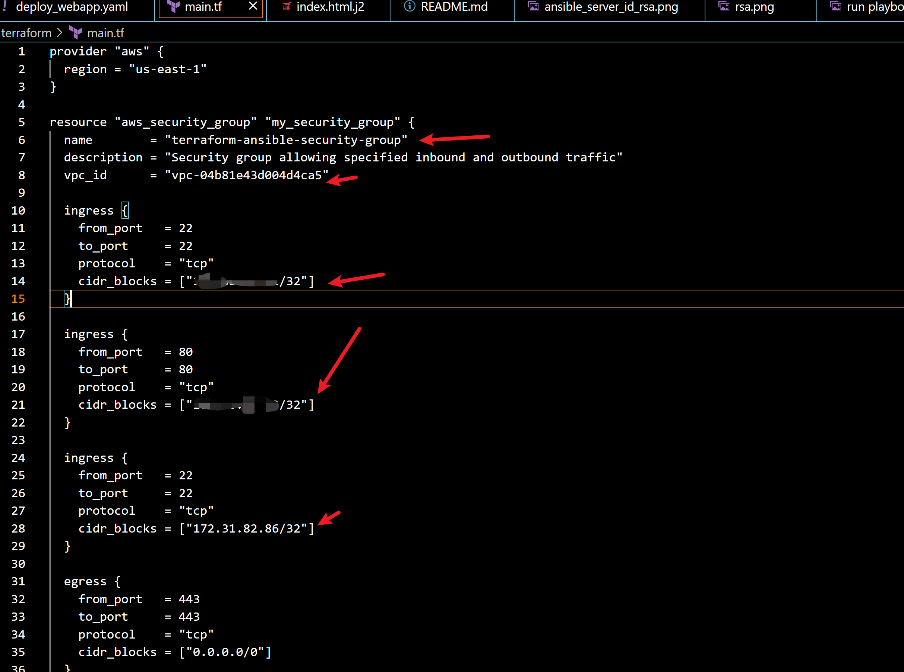
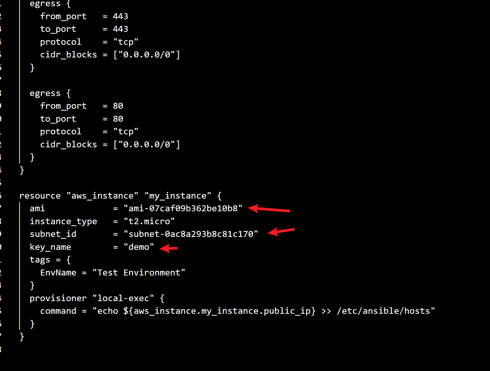
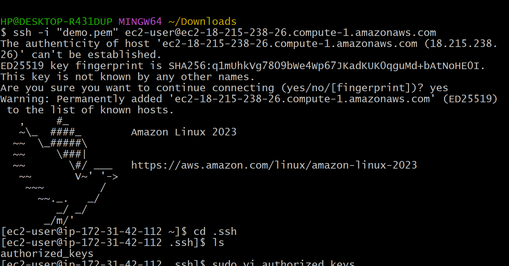
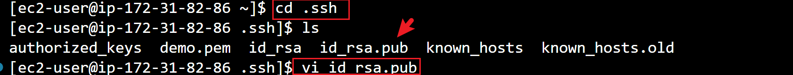
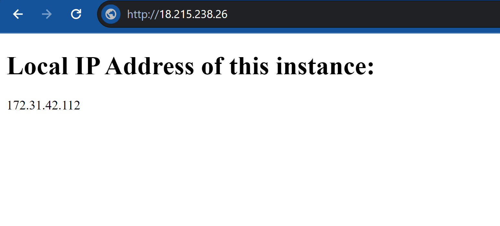

# Follow these steps to set up the automation environment on the Challenge host:

## Setup Instructions
1. Clone this repo to your linux machine
```
git clone https://github.com/TobiOlajumoke/terraform-ansible-project
```

2. Install Terraform and Ansible:

    - Terraform: Download Terraform from the [official website](https://developer.hashicorp.com/terraform/tutorials/aws-get-started/install-cli) and follow the installation instructions for your operating system.

    - Ansible: Install Ansible using a package manager like apt, yum, or brew. For example, on Ubuntu:
```bash
sudo apt update
sudo apt install ansible
```
or follow their thier offical [website](https://docs.ansible.com/ansible/latest/installation_guide/intro_installation.html#pipx-install)


3. We wanna give terraform permission to write to this `/etc/ansible/hosts` file
if the file doesn't exit create one

    and run this commands:

```
sudo chown $(whoami) /etc/ansible/hosts
sudo chmod u+w /etc/ansible/hosts

```
This command will allow terraform to pass the public ip or the newly created instance into the ansible host file

# Deploying the Infrastructure
1. `cd terraform` into Terraform folder
in your main.tf file add the corrrect vaules

```
provider "aws" {
  region = "your_aws_region"
}

resource "aws_security_group" "my_security_group" {
  name        = "my-security-group"
  description = "Security group allowing specified inbound and outbound traffic"
  vpc_id      = "your_existing_vpc_id"

  ingress {
    from_port   = 22
    to_port     = 22
    protocol    = "tcp"
    cidr_blocks = ["your_ip_address/32"]
  }

  ingress {
    from_port   = 80
    to_port     = 80
    protocol    = "tcp"
    cidr_blocks = ["your_ip_address/32"]
  }

  ingress {
    from_port   = 22
    to_port     = 22
    protocol    = "tcp"
    cidr_blocks = ["ansible_server_ip_address/32"]
  }

  egress {
    from_port   = 443
    to_port     = 443
    protocol    = "tcp"
    cidr_blocks = ["0.0.0.0/0"]
  }

  egress {
    from_port   = 80
    to_port     = 80
    protocol    = "tcp"
    cidr_blocks = ["0.0.0.0/0"]
  }
}

resource "aws_instance" "my_instance" {
  ami           = "your_ami_id"
  instance_type = "t2.micro"
  subnet_id     = "your_subnet_id"
  key_name = add key name eg "demo_key"

  tags = {
    EnvName = "Test Environment"
  }
  provisioner "local-exec" {
    command = "echo ${aws_instance.my_instance.public_ip} >> /etc/ansible/hosts"
  }
}
```
add your variables, eg to where the red arrow points




2. `cd terraform` into Terraform folder and run the following commands:

```
terraform init
```

```
terraform plan
```
```
terraform apply
```

once your instance is running connect via ssh with your local machine with the ip you specified above:


```
cd .ssh
```
```
ls
```

you should see:
```
authorised keys
```


now ssh into the ansible instance:
```
cd .ssh
```

```
vi id_rsa.pub
```


add copied `id_rsa.pub` key into the authorised key file on our websever instance

```
vi authorised keys
```
paste key there

# Deploying the Web Application
1. Go into the ansible folder `cd ansible`

run the playbook:
```
ansible-playbook deploy_webapp.yaml
```

you'll get an output like this:


Now access the public url of websever instance:

```
http://public_ip_address
```

you'll see something like this:



when you're done with this project run the command:
```
terraform destroy
```
To clean up the resources created


# Why Use Terraform and Ansible Together?
Terraform and Ansible are both powerful tools for managing infrastructure and configuration, respectively. While they can be used independently, combining them offers several advantages:

1. Infrastructure as Code (IaC): Terraform allows you to define infrastructure as code, making it easy to provision and manage cloud resources. With Terraform, you can describe your entire infrastructure in a declarative configuration file, enabling version control, collaboration, and reproducibility.
2. Dynamic Configuration Management: Ansible excels at configuration management, allowing you to automate the deployment and configuration of software and services on your infrastructure. By integrating Ansible with Terraform, you can dynamically provision resources with Terraform and then configure them with Ansible, ensuring consistency and scalability across your environment.
3. Separation of Concerns: Terraform focuses on infrastructure provisioning, while Ansible focuses on configuration management. Separating these concerns allows for clearer and more maintainable code. Terraform handles the creation and management of cloud resources, while Ansible handles the installation, configuration, and orchestration of software and services on those resources.
4. Flexibility and Extensibility: Using Terraform and Ansible together provides flexibility and extensibility in managing infrastructure and configuration. Terraform's provider ecosystem allows you to integrate with various cloud providers and services, while Ansible's extensive module library enables automation across a wide range of platforms and technologies.
5. Holistic Automation: By combining Terraform and Ansible, you can achieve end-to-end automation of your infrastructure and application deployment processes. From provisioning cloud resources to configuring software and services, you can automate the entire lifecycle of your environment, improving efficiency and reducing manual intervention.
6. Scalability and Consistency: Terraform and Ansible help maintain scalability and consistency in your infrastructure and configuration. With Terraform, you can easily scale resources up or down based on demand, while Ansible ensures that configurations are applied consistently across all instances, reducing configuration drift and ensuring compliance.
